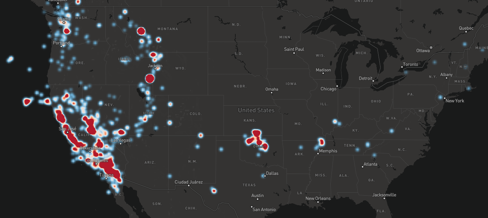
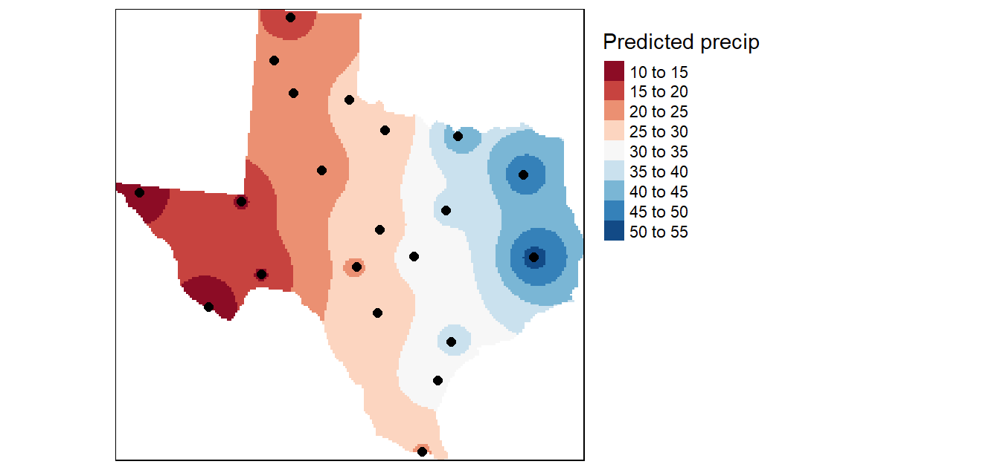

# InterpolateHeatmapLayer

InterpolateHeatmapLayer is a minimalist JavaScript library for rendering temperature maps (or interpolate heatmaps) with [Mapbox GJ JS](https://docs.mapbox.com/mapbox-gl-js/guides/). This library was greatly inspired by the [temperature-map-gl](https://github.com/ham-systems/temperature-map-gl) library, and depends on [Earcut](https://github.com/mapbox/earcut).

Currently, Mapbox provides a heatmap layer that represent the **density** of points in an area, like on this picture:



This library aims at providing a heatmap that can define a color to any location by making an **average** of the values of the surroundings points, like on this picture:



Except a JavaScript pre-processing step, all computation is made with WebGL shaders.

## Examples

A live demo showing the global temperature is available [here](https://rylern.github.io/TemperatureMap/), described [here](https://github.com/Rylern/TemperatureMap).

## Install

* Browser:

  * Copy the [interpolateHeatmapLayer.js](https://github.com/Rylern/InterpolateHeatmapLayer/blob/main/dist/interpolateHeatmapLayer.js) file to your project.

  * Import the library before the script using it:

    ```html
    <body>
        <div id="map"></div>
        <script src="interpolateHeatmapLayer.js"></script>
        <script src="map.js"></script>
    </body>
    ```

  * Create the Mapbox map and add the layer created by `interpolateHeatmapLayer.create()`:

  ```javascript
  // map.js
  
  const map = (window.map = new mapboxgl.Map({
      container: 'map',
      style: 'mapbox://styles/mapbox/light-v10'
  }));
      
  map.on('load', () => {
      const layer = interpolateHeatmapLayer.create({
          // parameters here
      });
      map.addLayer(layer);
  });
  ```


* NPM:

  ```bash
  npm install interpolateheatmaplayer
  ```

  ```javascript
  const interpolateHeatmapLayer = require('interpolateheatmaplayer');
  
  const map = (window.map = new mapboxgl.Map({
      container: 'map',
      style: 'mapbox://styles/mapbox/light-v10'
  }));
      
  map.on('load', () => {
      const layer = interpolateHeatmapLayer.create({
          // parameters here
      });
      map.addLayer(layer);
  });
  ```

## Usage

The `interpolateHeatmapLayer.create()` function has the following parameters:

* `points`: An array of points, each point being an object containing a latitude `lat`, a longitude `lon`, and a value `val`. Example:

  ```javascript
  points = [{
    lat: 62.470663,
    lon: 6.176846,
    val: 16
  },
  {
    lat: 48.094903,
    lon: -1.371596,
    val: 20
  }];
  ```

  Since Mapbox uses the Web Mercator projection that projects the poles at infinity, remember to define the latitude within -85° and 85°. Default value: `[]`.

* `layerID`: unique [Mapbox layer](https://docs.mapbox.com/mapbox-gl-js/style-spec/layers/#id) name. Default value: `''`.

* `opacity`: a number between 0 and 1 describing the transparency of the color. Default value: `0.5`.

* `minValue`: define the value corresponding to the blue color. When it's not defined, the lowest value of `points` is represented by the blue color. If some value of `points` is lower than `minValue`, `minValue` takes this value. Default value: `Infinity`.

* `maxValue` same, but for the red color. Default value: `-Infinity`.

* `framebufferFactor`: number between 0 and 1. In short, if the framebuffer factor is around 0, the computation will be faster but less accurate. Take a look at the technical explanation part if you want to know what exactly this parameter is. Default value: `0.3`.

* `p`: a factor affecting the computation of the color. A high value makes the color uniform around each point. Once again, take a look at the technical explanation part if you want to know more. Default value: `3`.

* `roi`: region of interest, the layer will only be displayed inside that area. It's a list of coordinates with the same format as `points` (without the `val` attribute). If the list is empty, the entire map is the region of interest. Default value: `[]`.

* `valueToColor`: [GLSL](https://www.khronos.org/opengl/wiki/OpenGL_Shading_Language) function (passed as a string) that map a value to the heatmap color. By default, a low value is colored blue, a medium green and a high red. This parameter allows you to change this behavior. The function must be named `valueToColor` with a `float` parameter (which will take values between 0 and 1), and must return a ` vec3` (with each component between 0 and 1). Default value:

  ```glsl
  vec3 valueToColor(float value) {
    return vec3(max((value-0.5)*2.0, 0.0), 1.0 - 2.0*abs(value - 0.5), max((0.5-value)*2.0, 0.0));
  }
  ```


## Technical explanation

The color is computed using the [Inverse Distance Weighting](https://en.wikipedia.org/wiki/Inverse_distance_weighting) (IDW) algorithm:

Let:


be *N* known data points. We want to find a continuous and once differentiable function:


such as:


The basic form of the IDW is:


where


In WebGL:

* First, we render *N* textures. Each fragment of each texture contains *wi\*ui* in its red channel, and *wi* in its green channel.
* Then, we use blending with accumulator configuration on these *N* textures. It creates one texture, containing the sum of the *N* textures. Therefore, we can get u(x) for each fragment by dividing the red channel by the green channel.
* We pass this texture to the shader rendering the heatmap, convert u(x) to a color, and finally display this color.

The size of the computation textures is the size of the rendering texture multiplied by the `framebufferFactor`. This factor can be below 0.5 without any real visual consequences. If the user has defined a region of interest and uses a `framebufferFactor` < 1, visual artifacts appear at the edge of the heatmap. To prevent this, the rendering texture takes the whole screen size if `framebufferFactor` < 1.

